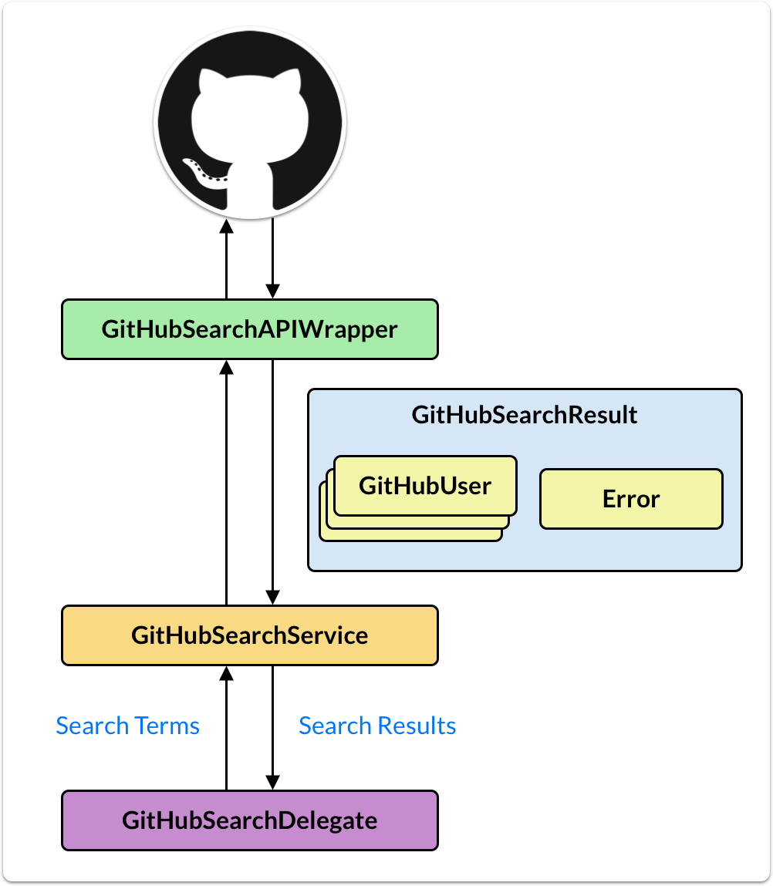

# Example GitHub Search app built in Flutter & RxDart

Simple app using the Flutter [`SearchDelegate`](https://api.flutter.dev/flutter/material/SearchDelegate-class.html) class to show a list of users matching the input search query:

The app uses `switchMap` & `debounce` from RxDart for a good user experience, without putting too much load on the server, or compromising bandwidth and battery life on the client.

Simple architecture diagram:

- `GitHubSearchAPIWrapper`: pulls the data from the GitHub REST API
- `GitHubSearchResult`: contains the API response data
- `GitHubSearchDelegate`: shows the search UI with a grid of results
- `GitHubSearchService`: holds the logic for wiring up the API wrapper with the UI

### Written tutorial here

- [RxDart by example: querying the GitHub Search API with switchMap & debounce](https://codewithandrea.com/videos/2020-05-11-rxdart-by-example-github-search/)

### Credits

This tutorial was heavily inspired by this talk by Brian Egan & Filip Hracek at ReactiveConf 2018:

- [ReactiveConf 2018 - Brian Egan & Filip Hracek: Practical Rx with Flutter](https://youtu.be/7O1UO5rEpRc)

### [LICENSE: MIT](LICENSE.md)

